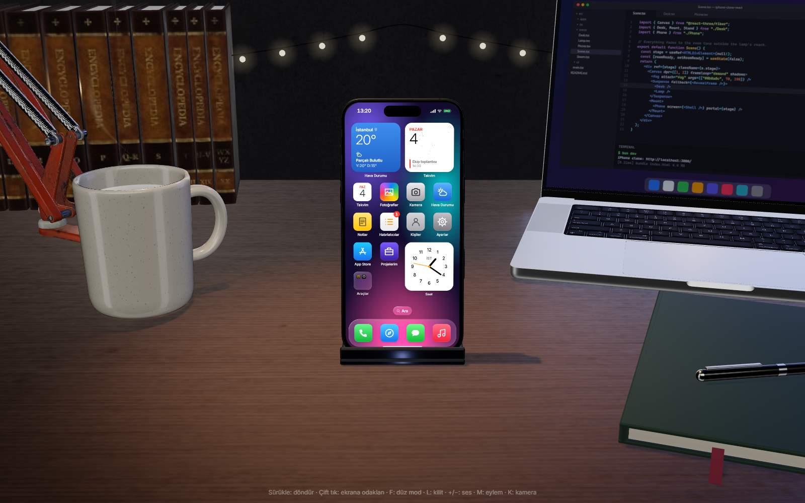
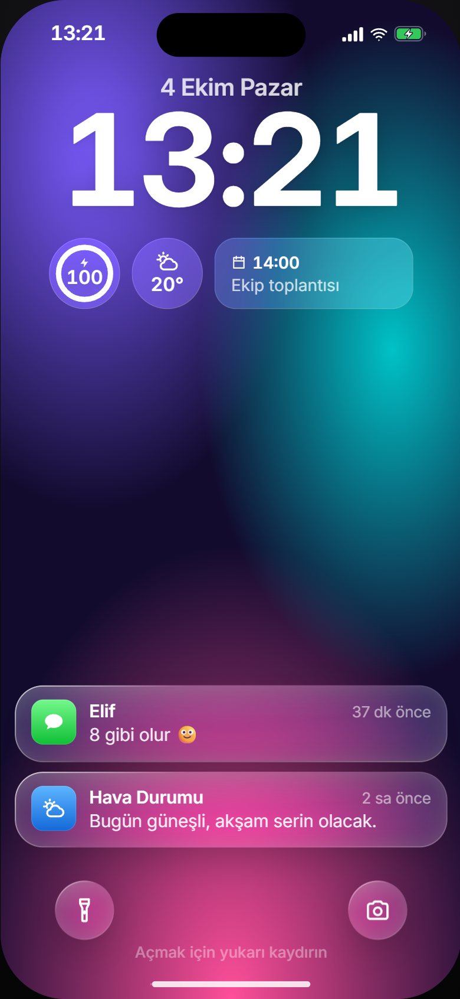
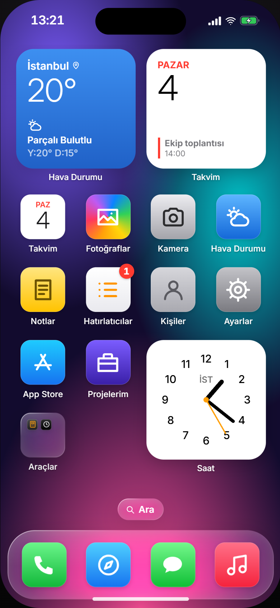
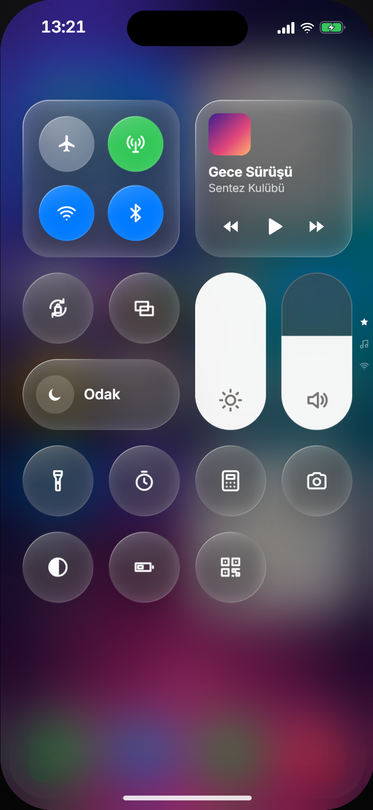
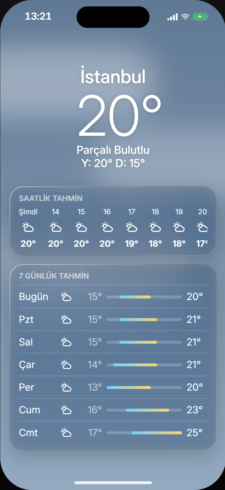

# iPhone Clone



<p align="center">
  
  
  
  
</p>

**🇹🇷 [Türkçe](#türkçe) · 🇬🇧 [English](#english)**

---

## Türkçe

Tarayıcıda çalışan bir iPhone. Three.js ile çizilmiş bir masanın üstünde iPhone 15 Pro Max duruyor; ekranında React ile yazılmış, iOS 26 "Liquid Glass" görünümlü bir arayüz ve 16 çalışan uygulama var.

### Çalıştır

```bash
bun install
bun dev
```

Sonra `http://localhost:3000` adresini aç.

### Kontroller

- **Fare:** sürükle = kamerayı döndür, çift tık = ekrana yakınlaş
- **Telefonda:** alttan yukarı kaydır = ana ekran, sağ üstten aşağı = Kontrol Merkezi
- **Klavye:** `F` düz mod (3D'siz) · `L` kilitle · `C` Kontrol Merkezi · `Esc` geri

### Kullanılanlar

React 19 · Three.js (React Three Fiber) · Zustand · Motion · Bun

---

## English

An iPhone that runs in your browser. An iPhone 15 Pro Max sits on a desk rendered with Three.js; its screen is a React UI in the iOS 26 "Liquid Glass" style with 16 working apps.

### Run

```bash
bun install
bun dev
```

Then open `http://localhost:3000`.

### Controls

- **Mouse:** drag = rotate the camera, double-click = zoom to the screen
- **On the phone:** swipe up from the bottom = home, swipe down from the top right = Control Center
- **Keyboard:** `F` flat mode (no 3D) · `L` lock · `C` Control Center · `Esc` back

### Built with

React 19 · Three.js (React Three Fiber) · Zustand · Motion · Bun

---

## Atıflar / Credits

- **iPhone modeli / model:** ["Apple iPhone 15 Pro Max Black"](https://sketchfab.com/3d-models/apple-iphone-15-pro-max-black-df17520841214c1792fb8a44c6783ee7), [polyman](https://sketchfab.com/Polyman_3D), [CC BY 4.0](http://creativecommons.org/licenses/by/4.0/), değiştirildi / modified (via [adrianhajdin/iphone](https://github.com/adrianhajdin/iphone))
- **MacBook modeli / model:** ["macbook pro M3 16 inch 2024"](https://sketchfab.com/3d-models/macbook-pro-m3-16-inch-2024-8e34fc2b303144f78490007d91ff57c4), [jackbaeten](https://sketchfab.com/jackbaeten), [CC BY 4.0](http://creativecommons.org/licenses/by/4.0/), değiştirildi / modified (via [ashi-s1/macbook-pro-3d](https://github.com/ashi-s1/macbook-pro-3d))
- **Diğer modeller ve dokular / Other models and textures:** [Poly Haven](https://polyhaven.com), [CC0](https://polyhaven.com/license)
